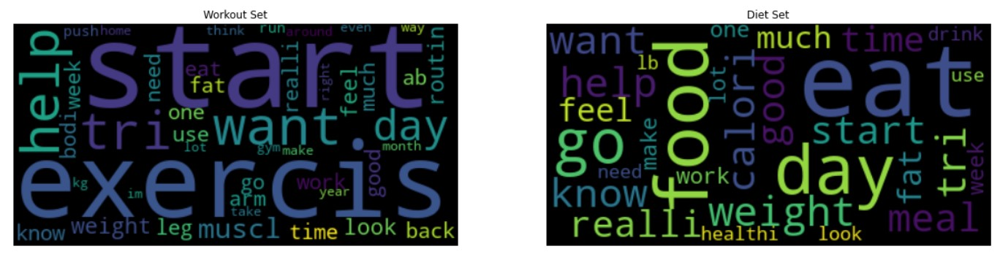

#  Project 3

# Web APIs & Classification

## Problem Statement

As a member of the Data Science Team in All Wellness online platform, we are tasked to use NLP to reduce the time and efforts required to classify members' online queries into fitness related or diet related, which will then be  channeled to the panel of certified fitness coach or nutritionist.

---

## Executive Summary

**Who we are**

With the increasing emphasis on health and wellness, All Wellness is a startup online platform aiming to help people improve their overall well being via different channels. One of our selling point is having a panel of certified fitness and nutrition coaches giving advices to our platform members on the fitness and dietary queries they have in their workout routine or nutrition and diet.

**The pain**

One issue All Wellness faced often is that when members wants to get advice via the platform, they typically do not label the nature of their question or label wrongly when they fill in the query form. To ensure the right queries gets to the right channel, lots of time and effort is required to manually tag the enormous amount of queries on a daily basis.

**What can be done**

Using Natural Language Processing, this tagging process can be automated as the queries come in, gets channel in the shortest amount of time, the panel of advisors gets the queries in real time and in turn members can be more engaged when the queries are correctly addressed.

**Solution**

Using training data from scrapping reddits, we have trained a Linear Regression model (with details decribed in the following sections in the Technical notebook) that is able to give us about **85%** accuracy on classifying the 2 categories.

Misclassifications can still occur if members have a generalized query (no specific indication on diet or workout),  has mixed queries/description or doesn't give enough details (short question of 2 or 3 words)

Model can be fine-tuned when there are more data to train on.

**Conclusion**

Overall, the model can be deployed to reduce some time and efforts for classifying, while collecting more data to fine-tune the model. Future enhancements can be made though more robust ensembling of models, and with more data collected.

**Future Enhancements**

With this solution, we can also consider creating a chatbot to provide members with some standard FAQ when the model detects certain words or word structure.

---

## Methodology

In this project, we will use Reddit's API to scrape 2 subreddits

-  ```/r/workout```
-  ```/r/diet/```

for posts and use NLP to train a classifer to identify the type of query.


Models use:
- Logistic Regression with CountVectorizer, TF-IDF
- Naive Bayes with CountVectorizer, TF-IDF
- KNearestNeighbours with (KNN) CountVectorizer, TF-IDF
- Support Vector Machines (SVM) with CountVectorizer, TF-IDF

The model with highest Accuracy and Matthews Correlation Coefficient (MCC) score for on the validation data set will be deployed

---

## Data Wrangling/Gathering


**Part 1** of the project focuses on **Data wrangling/gathering/acquisition**. This is a very important skill as not all the data you will need will be in clean CSVs or a single table in SQL. There is a good chance that wherever you land you will have to gather some data from some unstructured/semi-structured sources; when possible, requesting information from an API, but often scraping it because they don't have an API (or it's terribly documented).

For this project I will be using the reddit API and scrape 2 subreddits:

-  ```/r/workout```
-  ```/r/diet/```

for tagging and processing


Total of
- 998 text records for ```/r/workout``` in ```'workout.csv'```
- 998 text records for ```/r/diet``` in ```'diet.csv'```

After removing duplicates, we have total of 1833 rows for both posts with 2 columns:
- subreddit
- post


----

## NLP


**Part 2** of the project focuses on **Natural Language Processing** and converting standard text data (like Titles and Comments) into a format that allows us to analyze it and use it in modeling.

### Cleaning Data

- Removing HTML text
- Removing Non Letters
- Change to lower case
- Remove Stop words (common words, words related to topic)
  - ['diet', 'diets', 'dieting', 'dieter', 'dieters', 'dietary', 'dieted', 'workout', 'workouts', 'working', 'working out']
- Stemming


---

### EDA
<font color = "blue">

- Analyse the features of the data
- Create a Wordcloud to see the frequently occuring word. This will indicate how distinct the 2 subreddits are
- Examine the average length of each post: avg ~225 to 241 words per post
- Examine the common words to both documents, to be remove during the vectorizer </font>

#### WordCloud



## Model Prep

- Labelling (0- workout, 1- diet)

## Predictive Models
**Part 3** of the project focuses on **Classification Modeling.**

### Models with Hyperparameter tuning and Vectorizers

We will use both ```CountVectorizer()``` and ```TfidfVectorizer()``` to transform the data before fitting into the following models:

1. Logistic Regression
2. Naive Bayes
3. KNearestNeighbours with (KNN)
4. Support Vector Machines (SVM)

The models will be run with **hyperparameters tuning** for the various model using GridSearch on 5-folds Cross Validation

### Hyperparameters

**CountVectorizer Parameters:**
- max_features': [1000, 3000, 5000]
- max_df': [1, 3, 5, 7]

**TF-IDF Parameters:**
- max_features': [1000, 3000, 5000]
- max_df': [0.3, 0.4, 0.5, 0.7]
- ngram_range':[(1,2), (2,2)]

**Linear Regression:**
- solver': ['newton-cg', 'lbfgs', 'liblinear']
- C':[100,10,1.0, 0.1, 0.01]
- penalty':['l1', 'l2']

**KNeighbours:**
- n_neighbors': [3,5,7,9, 11, 13]

**Support Vector Machine:**
- svm__C': [1.0, 2.0, 3.0],
- svm__kernel': ['rbf', 'linear', 'poly'],
- svm__degree': [3,4,5]

### Performance Metrics

The models will be gauged on the performance using the following metrics:

**1) Accuracy - TP+TN/total records**
   - How accurate is the Model in predicting both classes?
   - The higher score the more accurate the model is at predicting the classes

**2) Matthews Correlation Coefficient (MCC)**
   - What is the correlation coefficient between the observed and predicted binary classifications --  
   - the  higher the score indicates that the model was able to correctly predict the majority of positive data instances and the majority of negative data instances

Not considering other metrics like Recall or Specificity because the 2 classes are equally important, and not just looking at the positive class, and in this case, accuracy and MCC will be a better gauge on model performanace.


## Model Selection

## Summary of Performance of Models:

**Baseline Model**: 0.502 (majority Class)


|Model|Best Score|Acurracy on Training Data|Accuracy on Validation|MCC|Best Param|
|:------|:-----|:-----|:-------|:-------|:---|
|Logistic Regression w CountVectorizer|0.694|0.850|0.694|0.393|'cvec__max_df': 7, 'cvec__max_features': 5000, 'lr__C': 0.01, 'lr__penalty': 'l2', 'lr__solver': 'liblinear'|
|Logistic Regression w TF-IDF|0.883|0.954|0.851|0.703|'lr__C': 1.0, 'lr__penalty': 'l2', 'lr__solver': 'liblinear', 'tvec__max_df': 0.3, 'tvec__max_features': 3000, 'tvec__ngram_range': (1, 2)|
|Naive Bayes w CountVectorizer|0.706|0.864|0.690|0.383|'cvec__max_df': 7, 'cvec__max_features': 5000|
|Naive Bayes w TF-IDF|0.885|0.952|0.844|0.691|'tvec__max_df': 0.3, 'tvec__max_features': 3000, 'tvec__ngram_range': (1, 2)|
|KNN w CountVectorizer|0.559|0.657|0.579|0.196|'cvec__max_df': 7, 'cvec__max_features': 1000, 'knn__n_neighbors': 7|
|KNN w TF-IDF|0.813|0.843|0.800|0.616|'knn__n_neighbors': 13, 'tvec__max_df': 0.3, 'tvec__max_features': 5000, 'tvec__ngram_range': (1, 2)|
|SVM w CountVectorizer|0.675|0.906|0.654|0.316|'cvec__max_df': 7, 'cvec__max_features': 5000, 'svm__C': 3.0, 'svm__degree': 3, 'svm__kernel': 'rbf'|
|SVM w TF-IDF|0.877|0.998|0.844|0.691|'svm__C': 3.0, 'svm__degree': 3, 'svm__kernel': 'rbf', 'tvec__max_df': 0.3, 'tvec__max_features': 5000, 'tvec__ngram_range': (1, 2)|


## Observations


The model that performs best here is the **Logistic Regression w TF-IDF** with the following parameters

- 'lr__C': 1.0,
- 'lr__penalty': 'l2',
- 'lr__solver': 'liblinear'
- 'tvec__max_df': 0.3
- 'tvec__max_features': 3000,
- 'tvec__ngram_range': (1, 2)

which gives us:
- **0.851** accuracy score on Validation data
- **0.703** on MCC score onn Validation data


### Top Predictors


- workout: **routin(e),muscle, arm, exercis(e), up**
- diet   : **food, calori(e), meal, sugar, keto**


### Misclassified Data

Misclassifications occur when:
- Queries are too short (not enough details)
- Have generalized questions
- Mixed description (on working out) with dieting queries or vice versa  

## Conclusion

**Classification Model:**
- Logistic Regression with TFIDF give us the highest accuracy (0.85) and MCC (0.703) score
- This will be a good start to see how much time we can cut down from tagging the queries, and how fast we can channel the queries to the relevant parties.

**Next Steps:**
- More data Collection (scrapping from comments section)
- Fine tune accuracy using Ensembling of different models

**Final Goal:**
- Topic Modelling and Chatbot creation
